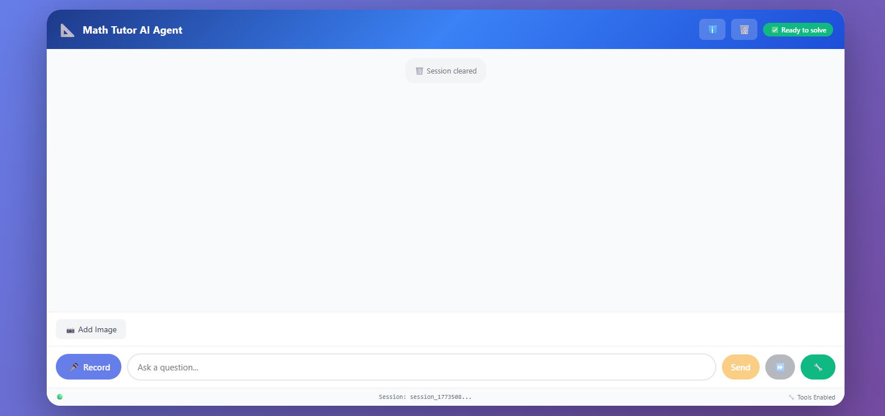
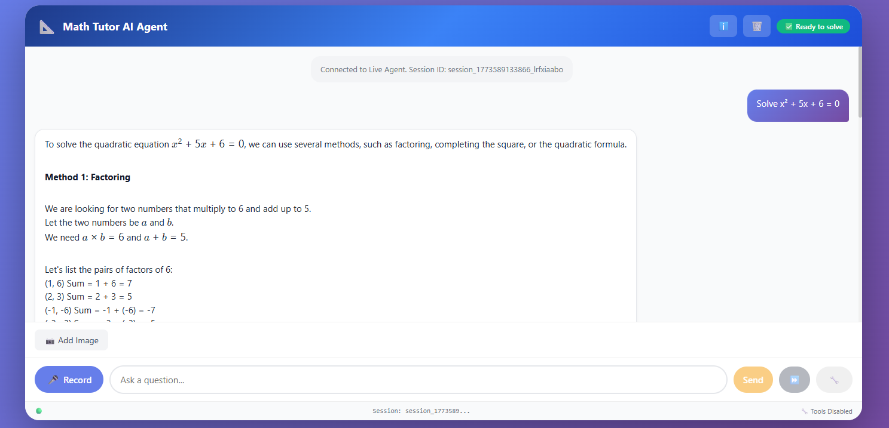
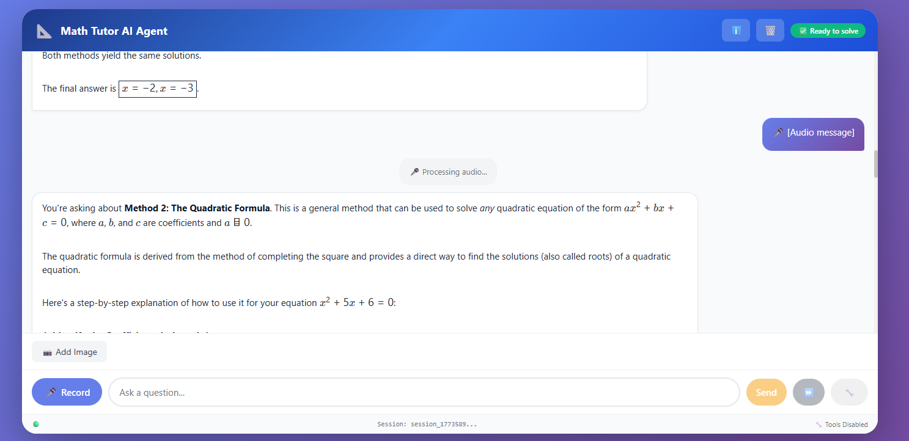
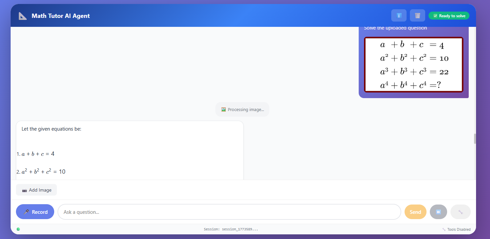

# 📐 Math Tutor AI Agent

## Your Personal Math Genius 🚀

Imagine having a **24/7 math tutor** who can:

- Solve equations step-by-step
- Understand handwritten math from photos
- Listen to spoken equations
- Explain calculus, algebra, geometry, and more
- Use advanced AI tools for complex proofs

**This is no ordinary chatbot. It's your multimodal math partner!**

## 🌟 Key Features

### Multimodal Math Magic

| Feature        | Icon | Description                                     |
| -------------- | ---- | ----------------------------------------------- |
| **Text Math**  | 📝   | `Solve x² + 5x + 6 = 0` → Step-by-step solution |
| **Image Math** | 📷   | Upload handwritten problems, printed worksheets |
| **Voice Math** | 🎤   | Speak equations: \"integral of sin(x)\"         |
| **Streaming**  | ⏩   | Real-time typing responses                      |
| **AI Tools**   | 🔧   | Advanced math engines, symbolic computation     |

### Real Examples

```
User: 📷 [photo of triangle]
AI: This is a 30-60-90 triangle. Side lengths: x, x√3, 2x
```

```
User: 🎤 \"What's the derivative of e^x sin(x)\"
AI: e^x (sin(x) + cos(x)) [with LaTeX rendering]
```

## 🎮 Quick Start

```bash
npm install
npm run dev
```

Open [localhost:5174](http://localhost:5174)

## 🏗️ Architecture

- **Frontend**: React + Vite + KaTeX for beautiful math rendering
- **Backend**: Specialized multimodal math AI agent (WebSocket + REST)
- **Communication**: Real-time streaming + tool calling

## 📱 Screenshots

| Hero - Main Interface                | Equation Solving                           | Multimodal Input                            | Advanced Features                         |
| ------------------------------------ | ------------------------------------------ | ------------------------------------------- | ----------------------------------------- |
|  |  |  |  |

## 🔮 What's Next?

- Handwriting recognition for scanned homework
- Interactive graphing (Desmos integration)
- Export solutions as PDF/LaTeX
- Multi-session memory for full courses

**Math problems? This agent has your back! 🎓**

---

_Built with ❤️ for math learners everywhere_
