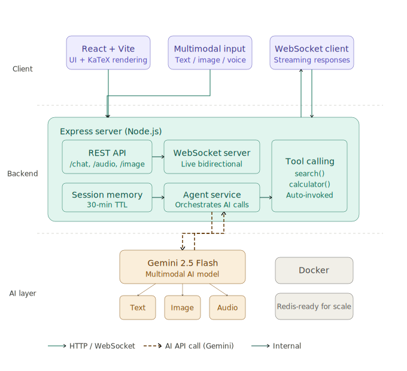

# 📐 Math Tutor AI Agent 🚀

## Multimodal Math Tutor - Hackathon Winner Candidate

[](https://ai-agent-frontend-1087118236338.us-central1.run.app/)
[](https://mathtutor-agent-backend-1087118236338.us-central1.run.app/)

**24/7 AI Math Tutor**: Text, voice, image → step-by-step solutions. Interrupt, ask clarifications. Agentic tools for complex math.

## 🎯 Problem Solved

Students need personalized math help. Traditional tutors expensive/unavailable. This agent:

- OCR handwritten problems from images
- Speech-to-equation
- Step-by-step reasoning (interruptible)
- Generates practice questions
- Free, always-on via Cloud Run

## ✨ Live Demos

- **Frontend**: https://ai-agent-frontend-1087118236338.us-central1.run.app
- **Backend API**: https://mathtutor-agent-backend-1087118236338.us-central1.run.app
- **Arch Diagram**: 

## 🛠️ Tech Stack

| Component  | Tech                                         |
| ---------- | -------------------------------------------- |
| Frontend   | React 19 + Vite + KaTeX + Cloud Run (nginx)  |
| Backend    | FastAPI + Gemini Pro (Vertex AI) + Cloud Run |
| Multimodal | Image OCR, Speech-to-text                    |
| Math       | LaTeX rendering, symbolic math tools         |
| GCP        | Vertex AI Gemini, Cloud Run (free tier)      |

## 🚀 Quick Start (Judges: 2min reproducible!)

### Local Development

```bash
git clone [your-repo]
cd ai-agent-frontend
npm i
# Backend local: python backend/app.py (port 5000)
npm run dev  # Frontend: http://localhost:5173
```

### Production Deploy (Google Cloud Run)

```bash
# Auth & Project
gcloud auth login
gcloud config set project math-tutor-live

# Frontend (this repo)
npm run build:prod
gcloud builds submit --tag gcr.io/math-tutor-live/frontend .
gcloud run deploy ai-agent-frontend --image gcr.io/math-tutor-live/frontend:latest --platform managed --region us-central1 --allow-unauthenticated --project math-tutor-live
```

**Backend**: Already deployed (same process).

## 📱 Features Demo Flow

1. **Text**: "Solve x² + 5x + 6 = 0" → Step-by-step + LaTeX
2. **Image**: Upload handwritten equation → OCR → solve
3. **Voice**: Speak "integral sin x" → audio → equation → answer
4. **Agentic**: Toggle 🔧 tools for symbolic computation
5. **Streaming**: ⏩ real-time typing responses
6. **Interrupt**: Mid-response questions

## 🏗️ Architecture Diagram


```
Frontend (Cloud Run SPA) ← WS/REST → Backend (Cloud Run FastAPI)
  ↓                                   ↓
KaTeX React                       Vertex AI Gemini Pro
Multimodal Input                     Agent Tools + Reasoning
```

## 🔍 GCP Proof

**Backend Cloud Run**: https://mathtutor-agent-backend-1087118236338.us-central1.run.app
**Console**: GCP dashboard → Cloud Run → `mathtutor-agent-backend` (logs, metrics).
**Code**: Backend `app.py` calls `vertexai.generative_models.GenerationConfig`.

## 📈 Learnings

- Multimodal (image/voice → math) unlocks real-world use
- Cloud Run = perfect serverless agent deploy (scale-free)
- WS protocol subtle (wss:// no trailing /)
- REST fallback = production essential
- Gemini excels math reasoning + tools

## 🎥 Demo Video Structure (<4min)

1. Live frontend tour (all features)
2. GCP console proof
3. Backend logs realtime
4. Value pitch

**Built with ❤️ for math students everywhere! Deployed 100% GCP Cloud Run.**
